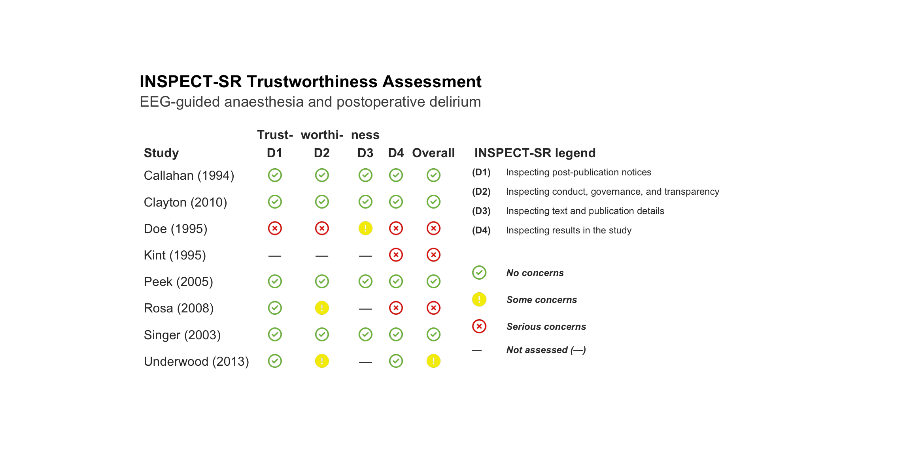
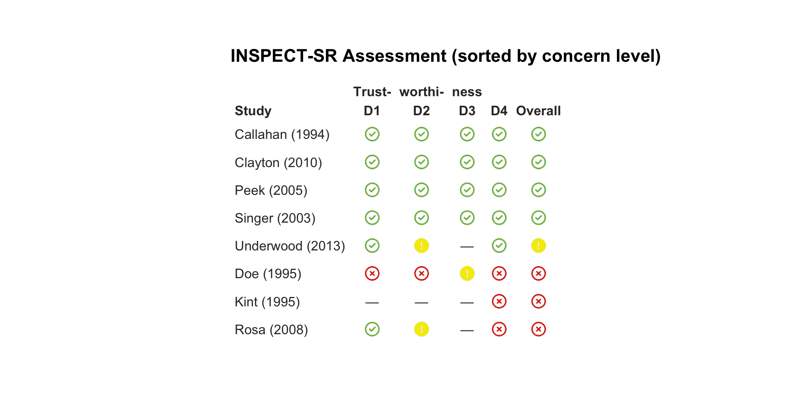
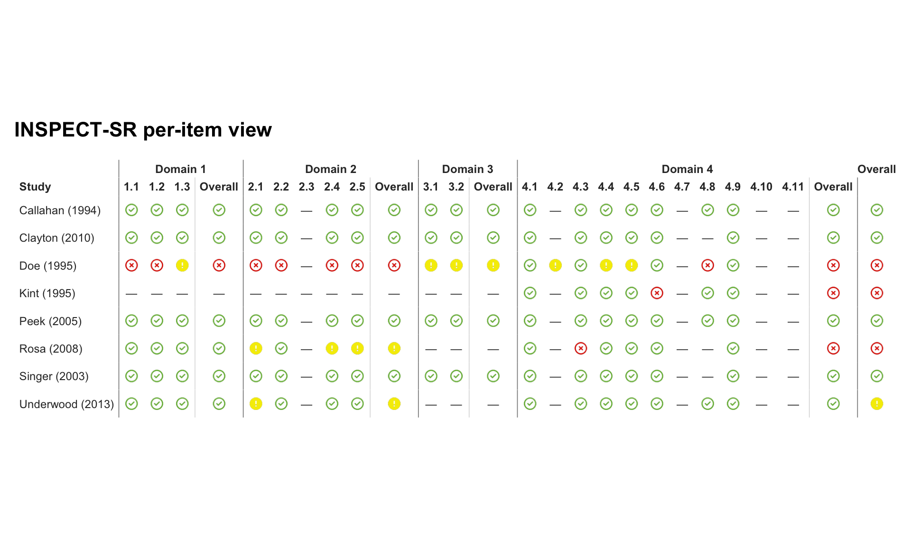
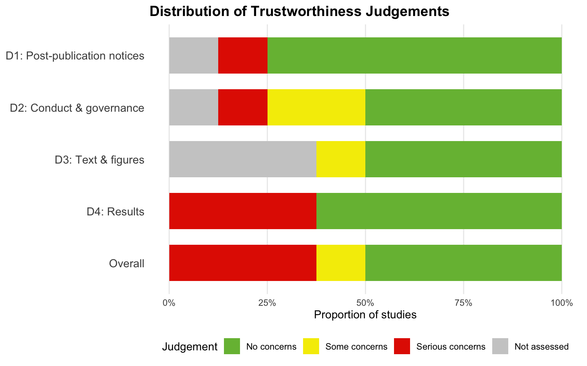

# INSPECT-SR: Assessing the Trustworthiness of RCTs

## Introduction

A systematic review is only as trustworthy as the primary studies it
includes. Risk of bias tools assess whether a trial was *conducted*
properly — they are not designed to detect whether the reported data are
*real*.

**INSPECT-SR** (INveStigating ProblEmatic Clinical Trials in Systematic
Reviews; Wilkinson et al., 2025) is a structured 21-item tool for
assessing the *trustworthiness* of RCTs included in a systematic review.
`bayesma` implements the full workflow in four steps:

1.  **[`inspect_sr()`](https://blmoran.github.io/bayesma/reference/inspect_sr.md)**
    — run the assessment (frequentist or Bayesian)
2.  **[`inspect_sr_table()`](https://blmoran.github.io/bayesma/reference/inspect_sr_table.md)**
    — inspect per-check details
3.  **[`inspect_plot()`](https://blmoran.github.io/bayesma/reference/inspect_plot.md)
    /
    [`inspect_summary_plot()`](https://blmoran.github.io/bayesma/reference/inspect_summary_plot.md)**
    — visualise
4.  **[`filter_trustworthy()`](https://blmoran.github.io/bayesma/reference/filter_trustworthy.md)**
    — filter for meta-analysis

## The four INSPECT-SR domains

| Domain | Items | Focus |
|----|----|----|
| **D1** | 3 | Post-publication notices (retractions, expressions of concern) |
| **D2** | 5 | Conduct, governance, and transparency |
| **D3** | 2 | Text and publication details |
| **D4** | 11 | Results in the study (statistical anomalies) |

Each domain receives **No concerns**, **Some concerns**, or **Serious
concerns**. The overall judgement is the most severe domain. `bayesma`
automates checks **4.3** (Carlisle), **4.6** (N consistency), **4.8**
(GRIM), and **4.9** (p-value verification); the remaining 17 items are
read from the input data frame.

## The input data frame

[`inspect_sr()`](https://blmoran.github.io/bayesma/reference/inspect_sr.md)
expects a single data frame with **one row per study**:

| Column(s) | Purpose |
|----|----|
| `study` | Study identifier (required, unique) |
| `n_randomised_int`, `n_randomised_ctrl`, `n_randomised_total`, `n_analysed_int`, `n_analysed_ctrl`, `n_lost_int`, `n_lost_ctrl` | CONSORT flow numbers → check 4.6 |
| `d1_1` … `d4_11` | Judgement for each item. Automated items (`d4_3`, `d4_6`, `d4_8`, `d4_9`) are overwritten |
| `d1_1_comment` … `d4_11_comment` | Optional free-text justification |
| `baseline` | **List-column** of Table 1 data frames → GRIM (4.8) and Carlisle (4.3) |
| `statistics` | **List-column** of reported test statistics → p-value check (4.9) |
| `outcome_estimate`, `outcome_ci_lower`, `outcome_ci_upper`, `outcome_se`, `outcome_log_scale` | Optional primary outcome |

## Worked example

The package ships `inspect_sr_example`, an eight-trial simulated review:

Code

``` r
data(inspect_sr_example)

# One row per study — manual items as columns, variable-length data as list-columns
dplyr::glimpse(dplyr::select(inspect_sr_example, study, d1_1, d2_1, d3_1, d4_1))
```

    Rows: 8
    Columns: 5
    $ study <chr> "Callahan (1994)", "Peek (2005)", "Clayton (2010)", "Singer (200…
    $ d1_1  <chr> "No concerns", "No concerns", "No concerns", "No concerns", "No …
    $ d2_1  <chr> "No concerns", "No concerns", "No concerns", "No concerns", "Som…
    $ d3_1  <chr> "No concerns", "No concerns", "No concerns", "No concerns", NA, …
    $ d4_1  <chr> "No concerns", "No concerns", "No concerns", "No concerns", "No …

Code

``` r
# Baseline data for the first study
inspect_sr_example$baseline[[1]]
```

       variable mean_int sd_int mean_ctrl sd_ctrl p_value integer_scale
    1       Age     71.2    8.3      69.8     9.1    0.45         FALSE
    2       BMI     24.8    4.1      25.1     3.9    0.72         FALSE
    3 ASA_score      2.5    0.5       2.5     0.5    0.34          TRUE

Code

``` r
# Test statistics for a study with two tests
inspect_sr_example$statistics[[2]]
```

      test_type statistic  df df2 reported_p              context
    1    chi_sq      4.12   1  NA       0.04   Delirium incidence
    2         t     -0.85 437  NA       0.40 Duration of delirium

The eight trials span a range of profiles:

| Study | Expected |
|----|----|
| Callahan, Peek, Clayton, Singer | Clean |
| Underwood | Manual D2 “Some concerns” (late registration) |
| Rosa | Carlisle flags too-perfect baseline balance |
| Doe | Retracted; four GRIM failures |
| Kint | CONSORT arithmetic inconsistency |

### Step 1 — `inspect_sr()`

Code

``` r
freq_results <- inspect_sr(inspect_sr_example, studyvar = study)
```

    INSPECT-SR Trustworthiness Assessment
    ==================================================

    Study                     D1    D2    D3    D4       Overall
    ----------------------------------------------------------------------
    Callahan (1994)           OK    OK    OK    OK       No concerns
    Peek (2005)               OK    OK    OK    OK       No concerns
    Clayton (2010)            OK    OK    OK    OK       No concerns
    Singer (2003)             OK    OK    OK    OK       No concerns
    Underwood (2013)          OK    SOME  --    OK       Some concerns
    Rosa (2008)               OK    SOME  --    SERIOUS  Serious concerns
    Doe (1995)                SERIOUS SERIOUS SOME  SERIOUS  Serious concerns
    Kint (1995)               --    --    --    SERIOUS  Serious concerns

    Domains: D1 post-publication, D2 conduct/governance,
             D3 text/figures, D4 results (auto-filled for 4.3/4.6/4.8/4.9)
    OK = No concerns, SOME = Some concerns, SERIOUS = Serious concerns
    -- = Not assessed

    For a per-check table, call inspect_sr_table().

The `studyvar` argument uses tidyeval (unquoted), consistent with
[`bayesma()`](https://blmoran.github.io/bayesma/reference/bayesma.md)
and
[`bayes_forest()`](https://blmoran.github.io/bayesma/reference/bayes_forest.md).

### Step 2 — `inspect_sr_table()`

Code

``` r
# All automated check details
inspect_sr_table(freq_results)
```

| **INSPECT-SR Automated Check Details** |  |  |  |  |
|----|----|----|----|----|
| Domain 4 per-check results |  |  |  |  |
|  | Check | Item | Detail | Result |
| Callahan (1994) | Carlisle | Baseline p-value distribution | k = 3, fisher combined p = 0.3788, plausible | Pass |
|  | GRIM | ASA_score (Intervention) | mean = 2.5, n = 46 | Pass |
|  |  | ASA_score (Control) | mean = 2.5, n = 46 | Pass |
|  | N-consistency | Total randomised = Intervention + Control | expected = 92, observed = 92 | Pass |
|  |  | Intervention: Randomised = Analysed + Lost | expected = 46, observed = 46 | Pass |
|  |  | Control: Randomised = Analysed + Lost | expected = 46, observed = 46 | Pass |
|  |  | Intervention: Lost \<= Randomised | expected = 46, observed = 3 | Pass |
|  |  | Control: Lost \<= Randomised | expected = 46, observed = 2 | Pass |
|  | P-value | Delirium incidence | reported p = 0.27, recalculated p = 0.2674 (diff 0.002593) | Pass |
| Clayton (2010) | Carlisle | Baseline p-value distribution | k = 3, fisher combined p = 0.46, plausible | Pass |
|  | N-consistency | Total randomised = Intervention + Control | expected = 202, observed = 202 | Pass |
|  |  | Intervention: Randomised = Analysed + Lost | expected = 101, observed = 101 | Pass |
|  |  | Control: Randomised = Analysed + Lost | expected = 101, observed = 101 | Pass |
|  |  | Intervention: Lost \<= Randomised | expected = 101, observed = 3 | Pass |
|  |  | Control: Lost \<= Randomised | expected = 101, observed = 5 | Pass |
|  | P-value | Delirium incidence | reported p = 0.1, recalculated p = 0.09545 (diff 0.004552) | Pass |
| Doe (1995) | Carlisle | Baseline p-value distribution | k = 4, fisher combined p = 0.05859, plausible | Pass |
|  | GRIM | ASA_score (Intervention) | mean = 2.45, n = 90 | Fail |
|  |  | ASA_score (Control) | mean = 2.55, n = 90 | Fail |
|  |  | Pain_VAS (Intervention) | mean = 4.75, n = 90 | Fail |
|  |  | Pain_VAS (Control) | mean = 4.65, n = 90 | Fail |
|  | N-consistency | Total randomised = Intervention + Control | expected = 180, observed = 180 | Pass |
|  |  | Intervention: Randomised = Analysed + Lost | expected = 90, observed = 90 | Pass |
|  |  | Control: Randomised = Analysed + Lost | expected = 90, observed = 90 | Pass |
|  |  | Intervention: Lost \<= Randomised | expected = 90, observed = 2 | Pass |
|  |  | Control: Lost \<= Randomised | expected = 90, observed = 3 | Pass |
|  | P-value | Delirium incidence | reported p = 0.001, recalculated p = 0.000407 (diff 0.000593) | Pass |
|  |  | Delirium duration | reported p = 0.002, recalculated p = 0.001582 (diff 0.0004176) | Pass |
| Kint (1995) | Carlisle | Baseline p-value distribution | k = 3, fisher combined p = 0.4555, plausible | Pass |
|  | GRIM | Duration_surgery_min (Intervention) | mean = 175, n = 150 | Pass |
|  |  | Duration_surgery_min (Control) | mean = 180, n = 150 | Pass |
|  | N-consistency | Total randomised = Intervention + Control | expected = 300, observed = 300 | Pass |
|  |  | Intervention: Randomised = Analysed + Lost | expected = 150, observed = 147 | Fail |
|  |  | Control: Randomised = Analysed + Lost | expected = 150, observed = 146 | Fail |
|  |  | Intervention: Lost \<= Randomised | expected = 150, observed = 5 | Pass |
|  |  | Control: Lost \<= Randomised | expected = 150, observed = 8 | Pass |
|  | P-value | Delirium incidence | reported p = 0.08, recalculated p = 0.07734 (diff 0.002663) | Pass |
| Peek (2005) | Carlisle | Baseline p-value distribution | k = 4, fisher combined p = 0.3872, plausible | Pass |
|  | GRIM | Duration_surgery_min (Intervention) | mean = 185, n = 230 | Pass |
|  |  | Duration_surgery_min (Control) | mean = 190, n = 230 | Pass |
|  | N-consistency | Total randomised = Intervention + Control | expected = 460, observed = 460 | Pass |
|  |  | Intervention: Randomised = Analysed + Lost | expected = 230, observed = 230 | Pass |
|  |  | Control: Randomised = Analysed + Lost | expected = 230, observed = 230 | Pass |
|  |  | Intervention: Lost \<= Randomised | expected = 230, observed = 9 | Pass |
|  |  | Control: Lost \<= Randomised | expected = 230, observed = 12 | Pass |
|  | P-value | Delirium incidence | reported p = 0.04, recalculated p = 0.04238 (diff 0.002379) | Pass |
|  |  | Duration of delirium | reported p = 0.4, recalculated p = 0.3958 (diff 0.004209) | Pass |
| Rosa (2008) | Carlisle | Baseline p-value distribution | k = 6, fisher combined p = 4.265e-05, too_similar | Fail |
|  | N-consistency | Total randomised = Intervention + Control | expected = 240, observed = 240 | Pass |
|  |  | Intervention: Randomised = Analysed + Lost | expected = 120, observed = 120 | Pass |
|  |  | Control: Randomised = Analysed + Lost | expected = 120, observed = 120 | Pass |
|  |  | Intervention: Lost \<= Randomised | expected = 120, observed = 2 | Pass |
|  |  | Control: Lost \<= Randomised | expected = 120, observed = 3 | Pass |
|  | P-value | Delirium incidence | reported p = 0.005, recalculated p = 0.00511 (diff 0.0001103) | Pass |
| Singer (2003) | Carlisle | Baseline p-value distribution | k = 3, fisher combined p = 0.4289, plausible | Pass |
|  | N-consistency | Total randomised = Intervention + Control | expected = 1232, observed = 1232 | Pass |
|  |  | Intervention: Randomised = Analysed + Lost | expected = 614, observed = 614 | Pass |
|  |  | Control: Randomised = Analysed + Lost | expected = 618, observed = 618 | Pass |
|  |  | Intervention: Lost \<= Randomised | expected = 614, observed = 16 | Pass |
|  |  | Control: Lost \<= Randomised | expected = 618, observed = 13 | Pass |
|  | P-value | Delirium incidence | reported p = 0.67, recalculated p = 0.6714 (diff 0.001373) | Pass |
| Underwood (2013) | Carlisle | Baseline p-value distribution | k = 3, fisher combined p = 0.4773, plausible | Pass |
|  | GRIM | Duration_anaesthesia_min (Intervention) | mean = 210, n = 80 | Pass |
|  |  | Duration_anaesthesia_min (Control) | mean = 198, n = 80 | Pass |
|  | N-consistency | Total randomised = Intervention + Control | expected = 160, observed = 160 | Pass |
|  |  | Intervention: Randomised = Analysed + Lost | expected = 80, observed = 80 | Pass |
|  |  | Control: Randomised = Analysed + Lost | expected = 80, observed = 80 | Pass |
|  |  | Intervention: Lost \<= Randomised | expected = 80, observed = 4 | Pass |
|  |  | Control: Lost \<= Randomised | expected = 80, observed = 6 | Pass |
|  | P-value | Delirium incidence | reported p = 0.02, recalculated p = 0.02506 (diff 0.005056) | Pass |

Code

``` r
# Only failures
inspect_sr_table(freq_results, only_failed = TRUE)
```

| **INSPECT-SR Automated Check Details** |  |  |  |  |
|----|----|----|----|----|
| Domain 4 per-check results |  |  |  |  |
|  | Check | Item | Detail | Result |
| Doe (1995) | GRIM | ASA_score (Intervention) | mean = 2.45, n = 90 | Fail |
|  |  | ASA_score (Control) | mean = 2.55, n = 90 | Fail |
|  |  | Pain_VAS (Intervention) | mean = 4.75, n = 90 | Fail |
|  |  | Pain_VAS (Control) | mean = 4.65, n = 90 | Fail |
| Kint (1995) | N-consistency | Intervention: Randomised = Analysed + Lost | expected = 150, observed = 147 | Fail |
|  |  | Control: Randomised = Analysed + Lost | expected = 150, observed = 146 | Fail |
| Rosa (2008) | Carlisle | Baseline p-value distribution | k = 6, fisher combined p = 4.265e-05, too_similar | Fail |

Code

``` r
# Individual Tables
# E.g. Callaghan study
inspect_sr_table(freq_results, study = "Callaghan (1994)")
```

- [Callahan (1994)](#tabset-1-1)
- [Peek (2005)](#tabset-1-2)
- [Clayton (2010)](#tabset-1-3)
- [Singer (2003)](#tabset-1-4)
- [Underwood (2013)](#tabset-1-5)
- [Rosa (2008)](#tabset-1-6)
- [Doe (1995)](#tabset-1-7)
- [Kint (1995)](#tabset-1-8)

&nbsp;

- | **INSPECT-SR Automated Check Details** |  |  |  |  |
  |----|----|----|----|----|
  | Domain 4 per-check results |  |  |  |  |
  |  | Check | Item | Detail | Result |
  | Callahan (1994) | Carlisle | Baseline p-value distribution | k = 3, fisher combined p = 0.3788, plausible | Pass |
  |  | GRIM | ASA_score (Intervention) | mean = 2.5, n = 46 | Pass |
  |  |  | ASA_score (Control) | mean = 2.5, n = 46 | Pass |
  |  | N-consistency | Total randomised = Intervention + Control | expected = 92, observed = 92 | Pass |
  |  |  | Intervention: Randomised = Analysed + Lost | expected = 46, observed = 46 | Pass |
  |  |  | Control: Randomised = Analysed + Lost | expected = 46, observed = 46 | Pass |
  |  |  | Intervention: Lost \<= Randomised | expected = 46, observed = 3 | Pass |
  |  |  | Control: Lost \<= Randomised | expected = 46, observed = 2 | Pass |
  |  | P-value | Delirium incidence | reported p = 0.27, recalculated p = 0.2674 (diff 0.002593) | Pass |

| **INSPECT-SR Automated Check Details** |  |  |  |  |
|----|----|----|----|----|
| Domain 4 per-check results |  |  |  |  |
|  | Check | Item | Detail | Result |
| Peek (2005) | Carlisle | Baseline p-value distribution | k = 4, fisher combined p = 0.3872, plausible | Pass |
|  | GRIM | Duration_surgery_min (Intervention) | mean = 185, n = 230 | Pass |
|  |  | Duration_surgery_min (Control) | mean = 190, n = 230 | Pass |
|  | N-consistency | Total randomised = Intervention + Control | expected = 460, observed = 460 | Pass |
|  |  | Intervention: Randomised = Analysed + Lost | expected = 230, observed = 230 | Pass |
|  |  | Control: Randomised = Analysed + Lost | expected = 230, observed = 230 | Pass |
|  |  | Intervention: Lost \<= Randomised | expected = 230, observed = 9 | Pass |
|  |  | Control: Lost \<= Randomised | expected = 230, observed = 12 | Pass |
|  | P-value | Delirium incidence | reported p = 0.04, recalculated p = 0.04238 (diff 0.002379) | Pass |
|  |  | Duration of delirium | reported p = 0.4, recalculated p = 0.3958 (diff 0.004209) | Pass |

| **INSPECT-SR Automated Check Details** |  |  |  |  |
|----|----|----|----|----|
| Domain 4 per-check results |  |  |  |  |
|  | Check | Item | Detail | Result |
| Clayton (2010) | Carlisle | Baseline p-value distribution | k = 3, fisher combined p = 0.46, plausible | Pass |
|  | N-consistency | Total randomised = Intervention + Control | expected = 202, observed = 202 | Pass |
|  |  | Intervention: Randomised = Analysed + Lost | expected = 101, observed = 101 | Pass |
|  |  | Control: Randomised = Analysed + Lost | expected = 101, observed = 101 | Pass |
|  |  | Intervention: Lost \<= Randomised | expected = 101, observed = 3 | Pass |
|  |  | Control: Lost \<= Randomised | expected = 101, observed = 5 | Pass |
|  | P-value | Delirium incidence | reported p = 0.1, recalculated p = 0.09545 (diff 0.004552) | Pass |

| **INSPECT-SR Automated Check Details** |  |  |  |  |
|----|----|----|----|----|
| Domain 4 per-check results |  |  |  |  |
|  | Check | Item | Detail | Result |
| Singer (2003) | Carlisle | Baseline p-value distribution | k = 3, fisher combined p = 0.4289, plausible | Pass |
|  | N-consistency | Total randomised = Intervention + Control | expected = 1232, observed = 1232 | Pass |
|  |  | Intervention: Randomised = Analysed + Lost | expected = 614, observed = 614 | Pass |
|  |  | Control: Randomised = Analysed + Lost | expected = 618, observed = 618 | Pass |
|  |  | Intervention: Lost \<= Randomised | expected = 614, observed = 16 | Pass |
|  |  | Control: Lost \<= Randomised | expected = 618, observed = 13 | Pass |
|  | P-value | Delirium incidence | reported p = 0.67, recalculated p = 0.6714 (diff 0.001373) | Pass |

| **INSPECT-SR Automated Check Details** |  |  |  |  |
|----|----|----|----|----|
| Domain 4 per-check results |  |  |  |  |
|  | Check | Item | Detail | Result |
| Underwood (2013) | Carlisle | Baseline p-value distribution | k = 3, fisher combined p = 0.4773, plausible | Pass |
|  | GRIM | Duration_anaesthesia_min (Intervention) | mean = 210, n = 80 | Pass |
|  |  | Duration_anaesthesia_min (Control) | mean = 198, n = 80 | Pass |
|  | N-consistency | Total randomised = Intervention + Control | expected = 160, observed = 160 | Pass |
|  |  | Intervention: Randomised = Analysed + Lost | expected = 80, observed = 80 | Pass |
|  |  | Control: Randomised = Analysed + Lost | expected = 80, observed = 80 | Pass |
|  |  | Intervention: Lost \<= Randomised | expected = 80, observed = 4 | Pass |
|  |  | Control: Lost \<= Randomised | expected = 80, observed = 6 | Pass |
|  | P-value | Delirium incidence | reported p = 0.02, recalculated p = 0.02506 (diff 0.005056) | Pass |

| **INSPECT-SR Automated Check Details** |  |  |  |  |
|----|----|----|----|----|
| Domain 4 per-check results |  |  |  |  |
|  | Check | Item | Detail | Result |
| Rosa (2008) | Carlisle | Baseline p-value distribution | k = 6, fisher combined p = 4.265e-05, too_similar | Fail |
|  | N-consistency | Total randomised = Intervention + Control | expected = 240, observed = 240 | Pass |
|  |  | Intervention: Randomised = Analysed + Lost | expected = 120, observed = 120 | Pass |
|  |  | Control: Randomised = Analysed + Lost | expected = 120, observed = 120 | Pass |
|  |  | Intervention: Lost \<= Randomised | expected = 120, observed = 2 | Pass |
|  |  | Control: Lost \<= Randomised | expected = 120, observed = 3 | Pass |
|  | P-value | Delirium incidence | reported p = 0.005, recalculated p = 0.00511 (diff 0.0001103) | Pass |

| **INSPECT-SR Automated Check Details** |  |  |  |  |
|----|----|----|----|----|
| Domain 4 per-check results |  |  |  |  |
|  | Check | Item | Detail | Result |
| Doe (1995) | Carlisle | Baseline p-value distribution | k = 4, fisher combined p = 0.05859, plausible | Pass |
|  | GRIM | ASA_score (Intervention) | mean = 2.45, n = 90 | Fail |
|  |  | ASA_score (Control) | mean = 2.55, n = 90 | Fail |
|  |  | Pain_VAS (Intervention) | mean = 4.75, n = 90 | Fail |
|  |  | Pain_VAS (Control) | mean = 4.65, n = 90 | Fail |
|  | N-consistency | Total randomised = Intervention + Control | expected = 180, observed = 180 | Pass |
|  |  | Intervention: Randomised = Analysed + Lost | expected = 90, observed = 90 | Pass |
|  |  | Control: Randomised = Analysed + Lost | expected = 90, observed = 90 | Pass |
|  |  | Intervention: Lost \<= Randomised | expected = 90, observed = 2 | Pass |
|  |  | Control: Lost \<= Randomised | expected = 90, observed = 3 | Pass |
|  | P-value | Delirium incidence | reported p = 0.001, recalculated p = 0.000407 (diff 0.000593) | Pass |
|  |  | Delirium duration | reported p = 0.002, recalculated p = 0.001582 (diff 0.0004176) | Pass |

| **INSPECT-SR Automated Check Details** |  |  |  |  |
|----|----|----|----|----|
| Domain 4 per-check results |  |  |  |  |
|  | Check | Item | Detail | Result |
| Kint (1995) | Carlisle | Baseline p-value distribution | k = 3, fisher combined p = 0.4555, plausible | Pass |
|  | GRIM | Duration_surgery_min (Intervention) | mean = 175, n = 150 | Pass |
|  |  | Duration_surgery_min (Control) | mean = 180, n = 150 | Pass |
|  | N-consistency | Total randomised = Intervention + Control | expected = 300, observed = 300 | Pass |
|  |  | Intervention: Randomised = Analysed + Lost | expected = 150, observed = 147 | Fail |
|  |  | Control: Randomised = Analysed + Lost | expected = 150, observed = 146 | Fail |
|  |  | Intervention: Lost \<= Randomised | expected = 150, observed = 5 | Pass |
|  |  | Control: Lost \<= Randomised | expected = 150, observed = 8 | Pass |
|  | P-value | Delirium incidence | reported p = 0.08, recalculated p = 0.07734 (diff 0.002663) | Pass |

The table is grouped by study with thick separators. Failures are
highlighted in red; passes in green.

### Step 3 — Visualise

#### Traffic-light plot

Code

``` r
inspect_plot(
  freq_results,
  add_legend = TRUE,
  title    = "INSPECT-SR Trustworthiness Assessment",
  subtitle = "EEG-guided anaesthesia and postoperative delirium"
)
```



Sort by severity:

Code

``` r
inspect_plot(freq_results, sort_studies_by = "overall",
             title = "INSPECT-SR Assessment (sorted by concern level)")
```



#### Expanded per-item view

Set `incl_checks = TRUE` to see every INSPECT-SR item (1.1 … 4.11)
grouped under domain spanner headers, with a per-domain Overall column
and a final study-level Overall. The four Domain 4 cells filled in by
the automated pipeline (4.3 Carlisle, 4.6 N-consistency, 4.8 GRIM, 4.9
p-value) appear alongside the manual items.

Code

``` r
inspect_plot(freq_results, incl_checks = TRUE,
             title = "INSPECT-SR per-item view")
```



#### Summary bar chart

Code

``` r
inspect_summary_plot(freq_results,
                     title = "Distribution of Trustworthiness Judgements")
```



### Step 4 — Filter for meta-analysis

Code

``` r
# Primary analysis: exclude Serious concerns
data_primary <- filter_trustworthy(
  my_meta_data, freq_results,
  studyvar = study, exclude = "serious"
)

# Sensitivity: also exclude Some concerns
data_strict <- filter_trustworthy(
  my_meta_data, freq_results,
  studyvar = study, exclude = "some"
)

attr(data_primary, "excluded_studies")
```

## The Bayesian extension

Pass `bayes = TRUE` to get Bayes factors instead of pass/fail:

Code

``` r
bayes_results <- inspect_sr(inspect_sr_example, studyvar = study, bayes = TRUE)
```

    Bayesian INSPECT-SR Trustworthiness Assessment
    ======================================================================

    Study                        Prior  Posterior         BF  Interpretation
    ------------------------------------------------------------------------------------------
    Callahan (1994)              0.900      0.999      0.010  Trustworthy (no concerns)
    Peek (2005)                  0.900      1.000      0.003  Trustworthy (no concerns)
    Clayton (2010)               0.900      0.996      0.036  Trustworthy (no concerns)
    Singer (2003)                0.900      0.995      0.049  Trustworthy (no concerns)
    Underwood (2013)             0.900      0.999      0.011  Trustworthy (no concerns)
    Rosa (2008)                  0.900      0.484      9.590  Likely untrustworthy (serious concerns)
    Doe (1995)                   0.900      0.000        Inf  Likely untrustworthy (serious concerns)
    Kint (1995)                  0.900      0.288     22.240  Likely untrustworthy (serious concerns)

    BF: combined Bayes factor against trustworthiness (>1 = evidence against)
    Posterior: P(trustworthy | data), prior = 0.9
    >0.90 no concerns, 0.50-0.90 some concerns, <0.50 serious

The per-check BFs are visible in the table:

Code

``` r
inspect_sr_table(bayes_results, only_failed = TRUE)
```

| **INSPECT-SR Automated Check Details** |  |  |  |  |  |
|----|----|----|----|----|----|
| Domain 4 per-check results |  |  |  |  |  |
|  | Check | Item | Detail | Result | BF |
| Doe (1995) | Carlisle | Baseline p-value distribution | k = 4, fisher combined p = 0.05859, plausible | Pass | 2.04 |
|  | GRIM | ASA_score (Intervention) | mean = 2.45, n = 90 | Fail | Inf |
|  |  | ASA_score (Control) | mean = 2.55, n = 90 | Fail | Inf |
|  |  | Pain_VAS (Intervention) | mean = 4.75, n = 90 | Fail | Inf |
|  |  | Pain_VAS (Control) | mean = 4.65, n = 90 | Fail | Inf |
| Kint (1995) | Carlisle | Baseline p-value distribution | k = 3, fisher combined p = 0.4555, plausible | Pass | 1.46 |
|  | N-consistency | Total randomised = Intervention + Control | expected = 300, observed = 300 | Pass | 400.00 |
|  |  | Intervention: Randomised = Analysed + Lost | expected = 150, observed = 147 | Fail | 400.00 |
|  |  | Control: Randomised = Analysed + Lost | expected = 150, observed = 146 | Fail | 400.00 |
|  |  | Intervention: Lost \<= Randomised | expected = 150, observed = 5 | Pass | 400.00 |
|  |  | Control: Lost \<= Randomised | expected = 150, observed = 8 | Pass | 400.00 |
| Peek (2005) | Carlisle | Baseline p-value distribution | k = 4, fisher combined p = 0.3872, plausible | Pass | 1.65 |
| Rosa (2008) | Carlisle | Baseline p-value distribution | k = 6, fisher combined p = 4.265e-05, too_similar | Fail | 287.64 |
| Singer (2003) | Carlisle | Baseline p-value distribution | k = 3, fisher combined p = 0.4289, plausible | Pass | 1.42 |

### Sensitivity to the prior

Code

``` r
r90 <- inspect_sr(inspect_sr_example, studyvar = study, bayes = TRUE,
                  prior_prob_trustworthy = 0.90, verbose = FALSE)
r75 <- inspect_sr(inspect_sr_example, studyvar = study, bayes = TRUE,
                  prior_prob_trustworthy = 0.75, verbose = FALSE)
r50 <- inspect_sr(inspect_sr_example, studyvar = study, bayes = TRUE,
                  prior_prob_trustworthy = 0.50, verbose = FALSE)

data.frame(
  Study   = r90$Study,
  Post_90 = round(r90$Posterior, 3),
  Post_75 = round(r75$Posterior, 3),
  Post_50 = round(r50$Posterior, 3)
)
```

                 Study Post_90 Post_75 Post_50
    1  Callahan (1994)   0.999   0.997   0.990
    2      Peek (2005)   1.000   0.999   0.997
    3   Clayton (2010)   0.996   0.988   0.965
    4    Singer (2003)   0.995   0.984   0.953
    5 Underwood (2013)   0.999   0.996   0.989
    6      Rosa (2008)   0.484   0.238   0.094
    7       Doe (1995)   0.000   0.000   0.000
    8      Kint (1995)   0.288   0.119   0.043

## The automated checks

### GRIM test (check 4.8)

The mean of $`n`$ integer observations must equal $`k/n`$ for some
integer $`k`$. A reported mean that fails this is mathematically
impossible.

Code

``` r
grim_test(3.45, n = 20)   # consistent
```

    $consistent
    [1] TRUE

    $mean_value
    [1] 3.45

    $n
    [1] 20

    $decimals
    [1] 2

Code

``` r
grim_test(3.47, n = 20)   # impossible
```

    $consistent
    [1] FALSE

    $mean_value
    [1] 3.47

    $n
    [1] 20

    $decimals
    [1] 2

Code

``` r
grim_test(2.45, n = 90)   # impossible (x.x5 at n=90)
```

    $consistent
    [1] FALSE

    $mean_value
    [1] 2.45

    $n
    [1] 90

    $decimals
    [1] 2

Bayesian version:

Code

``` r
bayes_grim_test(2.45, n = 90)
```

    $bf_inconsistent
    [1] Inf

    $posterior_prob_inconsistent
    [1] 1

    $consistent_at_n
    [1] FALSE

    $consistent_nearby
    [1] FALSE

    $interpretation
    [1] "strong_inconsistency"

    $mean_value
    [1] 2.45

    $n
    [1] 90

    $decimals
    [1] 2

### P-value verification (check 4.9)

Code

``` r
verify_pvalue("chi_sq", statistic = 4.12, df = 1, reported_p = 0.04)
```

    $consistent
    [1] TRUE

    $reported_p
    [1] 0.04

    $recalculated_p
    [1] 0.04237908

    $difference
    [1] 0.002379078

    $test_type
    [1] "chi_sq"

    $statistic
    [1] 4.12

Code

``` r
verify_pvalue("chi_sq", statistic = 3.84, df = 1, reported_p = 0.004)
```

    $consistent
    [1] FALSE

    $reported_p
    [1] 0.004

    $recalculated_p
    [1] 0.05004352

    $difference
    [1] 0.04604352

    $test_type
    [1] "chi_sq"

    $statistic
    [1] 3.84

### Carlisle’s test (check 4.3)

Code

``` r
carlisle_test(c(0.45, 0.12, 0.78, 0.33, 0.91))
```

    $too_similar
    [1] FALSE

    $too_different
    [1] FALSE

    $combined_p
    [1] 0.443096

    $n_comparisons
    [1] 5

    $method
    [1] "fisher"

    $interpretation
    [1] "plausible"

Code

``` r
carlisle_test(c(0.93, 0.81, 0.95, 0.94, 0.85, 0.95))
```

    $too_similar
    [1] TRUE

    $too_different
    [1] FALSE

    $combined_p
    [1] 4.264953e-05

    $n_comparisons
    [1] 6

    $method
    [1] "fisher"

    $interpretation
    [1] "too_similar"

### Participant number consistency (check 4.6)

Code

``` r
check_n_consistency(
  n_randomised_int = 150, n_randomised_ctrl = 150,
  n_analysed_int = 142, n_analysed_ctrl = 138,
  n_lost_int = 5, n_lost_ctrl = 8
)
```

    $consistent
    [1] FALSE

    $checks
                                           check expected observed  pass
    1 Intervention: Randomised = Analysed + Lost      150      147 FALSE
    2      Control: Randomised = Analysed + Lost      150      146 FALSE
    3           Intervention: Lost <= Randomised      150        5  TRUE
    4                Control: Lost <= Randomised      150        8  TRUE

    $n_checks
    [1] 4

    $n_failed
    [1] 2

## Reporting

> We assessed the trustworthiness of all included RCTs using INSPECT-SR
> (Wilkinson et al., 2025). Domain 4 checks were automated using the
> `bayesma` R package (GRIM test, p-value verification, Carlisle’s test,
> participant number consistency). Domains 1–3 were assessed manually by
> two independent reviewers. Studies with **Serious concerns** were
> excluded; **Some concerns** studies were retained in a sensitivity
> analysis.

## References

Brown NJL, Heathers JAJ (2017). The GRIM test. *Social Psychological and
Personality Science*, 8(4), 363–369.

Carlisle JB (2017). Data fabrication and other reasons for non-random
sampling in 5,087 RCTs. *Anaesthesia*, 72(8), 944–952.

Wilkinson J, Heal C, Flemyng E, et al. (2025). INSPECT-SR: a tool for
assessing trustworthiness of randomised controlled trials. *BMJ*, 389,
e082938.
