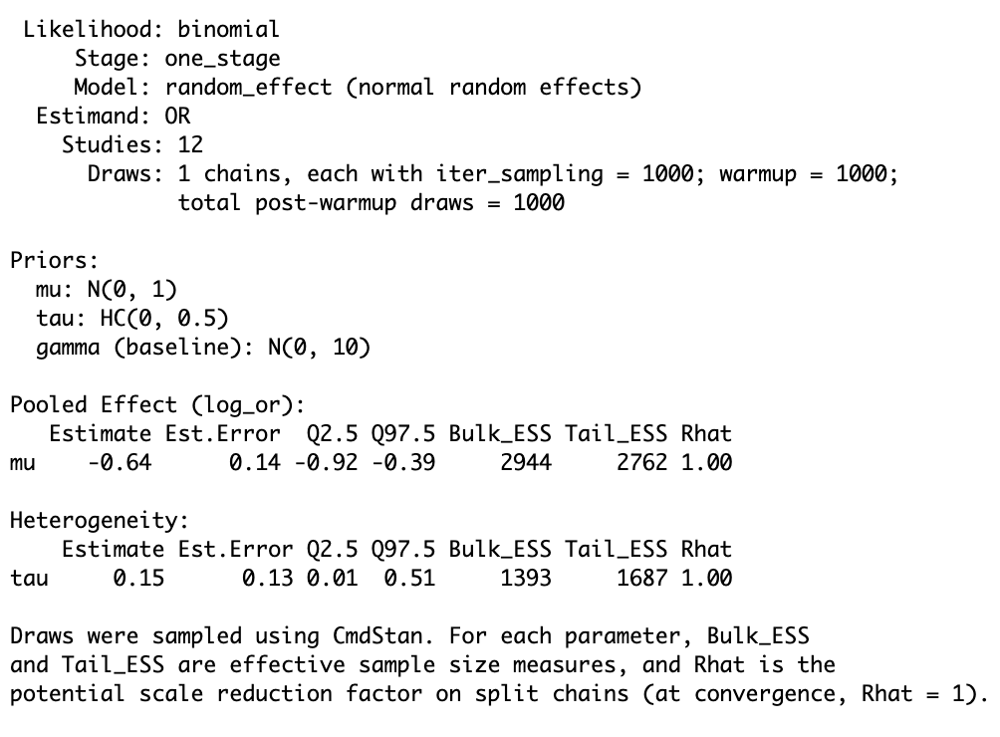
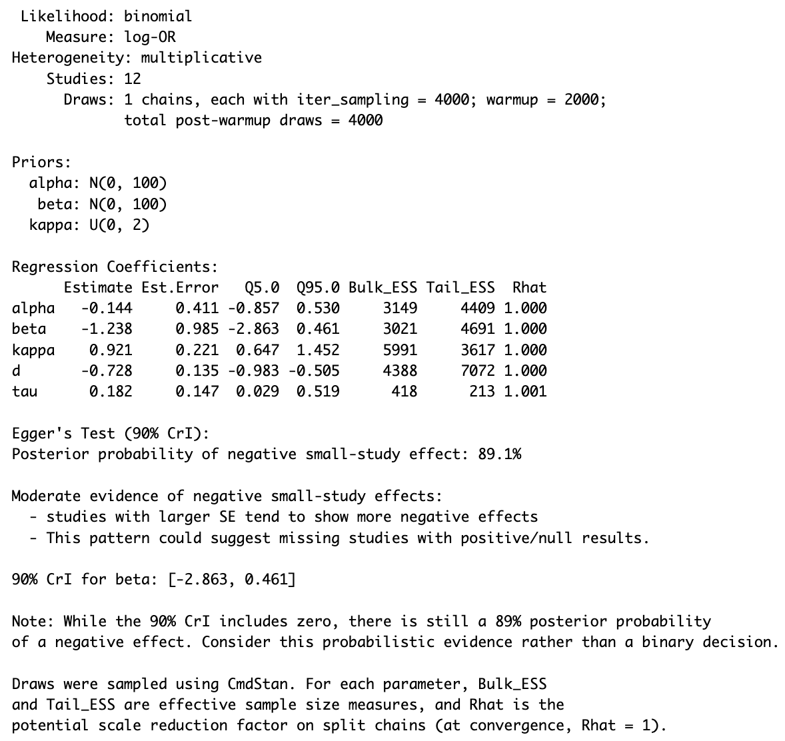
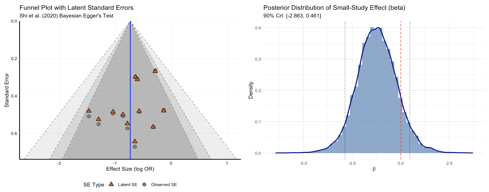
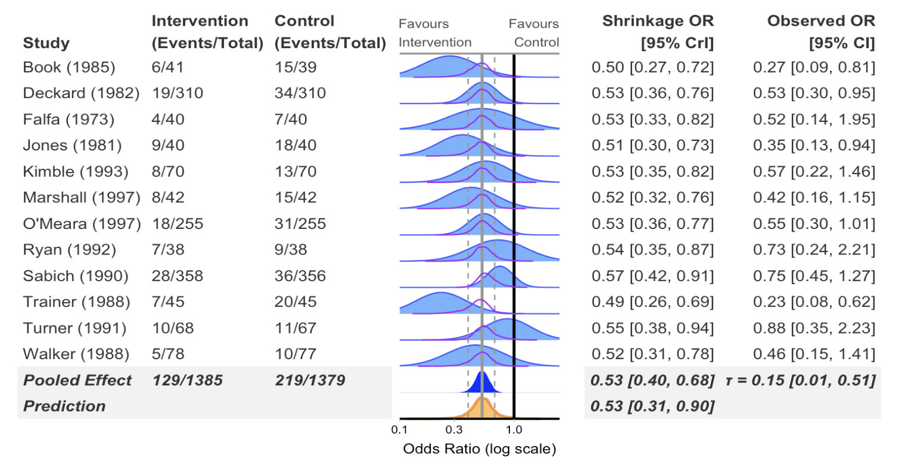
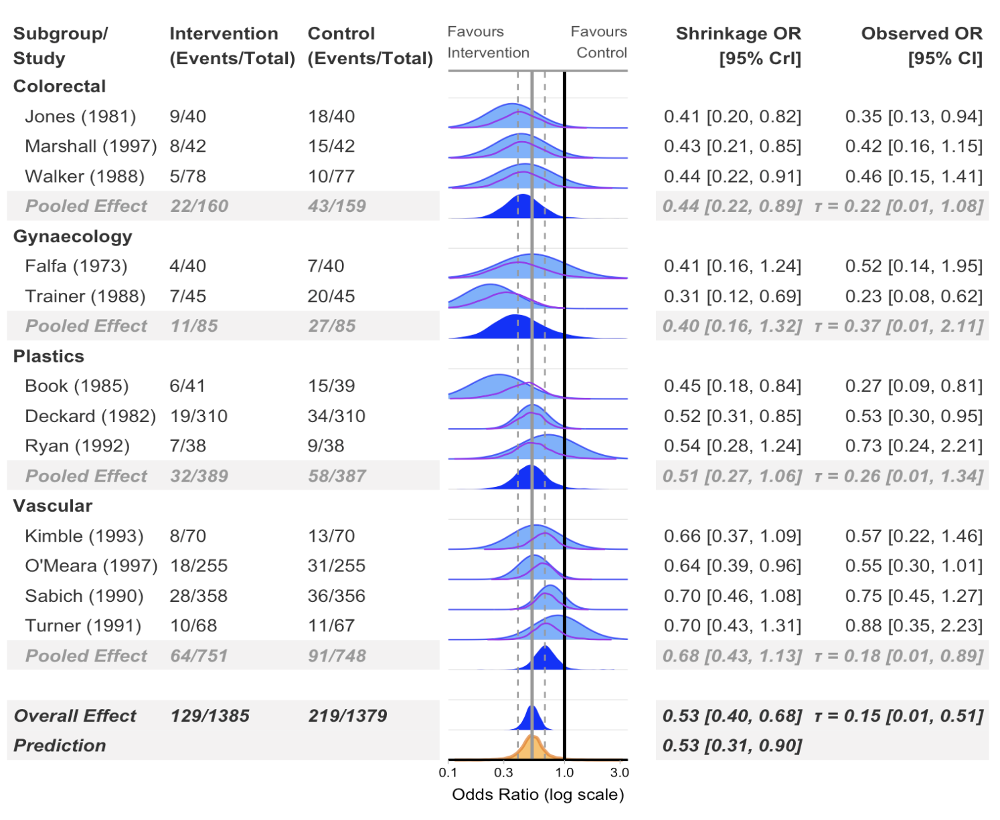
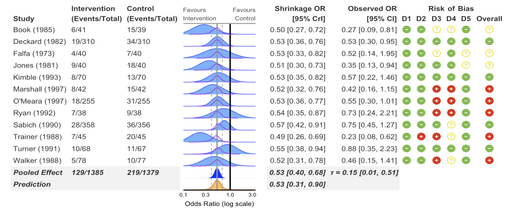
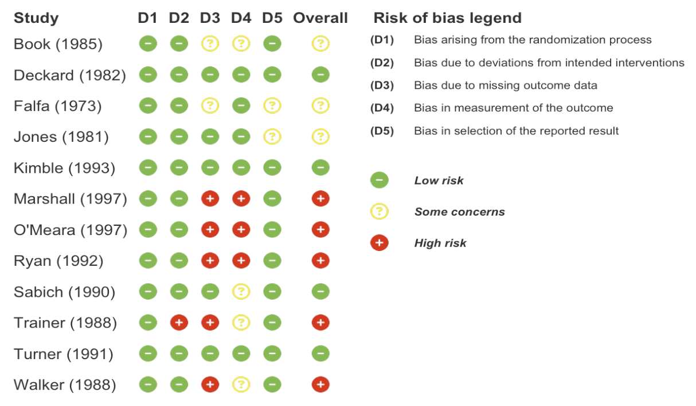
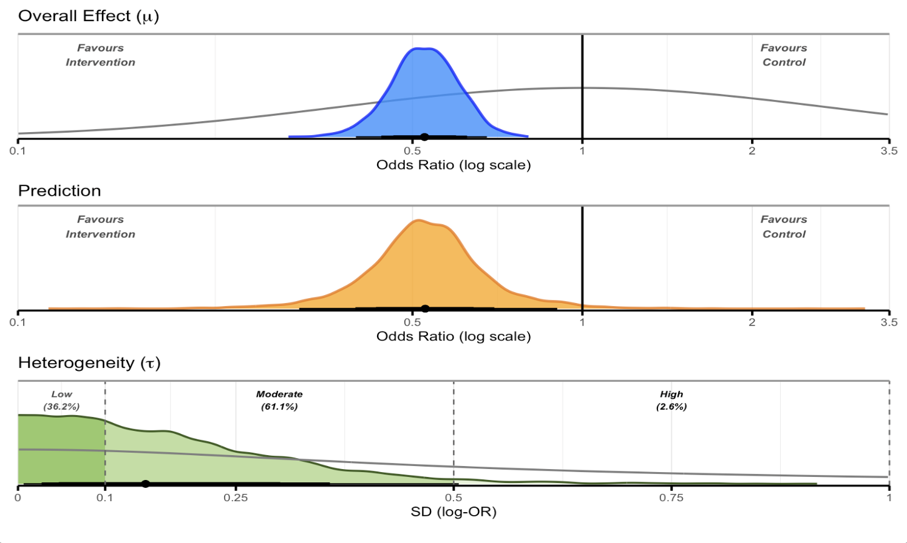

# bayesma: Bayesian Meta-Analysis using Stan

**bayesma** is an R package for conducting Bayesian meta-analyses using
Stan. It provides a complete, opinionated workflow from data preparation
through model fitting, publication bias correction, heterogeneity
assessment, and reporting — with sensible defaults and full prior
control at every stage.

## Getting Started

If you are new to Bayesian Meta Analysis, it is recommended to read the
workflow vignette and other vignettes in addition to these other
resources:

- [Bayesian Meta-Analysis: A Practical
  Introduction](https://bayesian-ma.net)
- [bayesmeta package
  vignettes](https://cran.r-project.org/web/packages/bayesmeta/vignettes/bayesmeta.html)
- [Matti Vuorre’s Blog: Meta-analysis is a special case of Bayesian
  multilevel
  modeling](https://vuorre.com/posts/bayesian-meta-analysis/index.html)
- Solomon Kurz’s blog- Bayesian meta-analysis in brms: [Part
  I](https://solomonkurz.netlify.app/blog/bayesian-meta-analysis/) and
  [Part
  II](https://solomonkurz.netlify.app/blog/2020-10-16-bayesian-meta-analysis-in-brms-ii/)
- [Doing Meta Analysis in R- Chapter 13: Bayesian
  Meta-Analysis](https://doing-meta.guide/bayesian-ma)

## Installation

Install the development version from GitHub:

``` r
# install.packages("remotes")
remotes::install_github("BLMoran/bayesma")
```

bayesma uses [cmdstanr](https://mc-stan.org/cmdstanr/) as its Stan
backend. If you do not already have it:

``` r
install.packages("cmdstanr", repos = c("https://stan-dev.r-universe.dev", getOption("repos")))
cmdstanr::install_cmdstan()
```

A C++ toolchain is required:
[Rtools](https://cran.r-project.org/bin/windows/Rtools/) on Windows, or
the Xcode command line tools on macOS (`xcode-select --install`).

## Overview

bayesma covers the full Bayesian meta-analysis workflow:

| Stage | What bayesma provides |
|----|----|
| **Data** | Structured input for binary, continuous, and count outcomes |
| **Trustworthiness** | INSPECT-SR assessment with tabular and visual output |
| **Exploration** | PRIMED: dependence structure, effect-size distribution, moderators |
| **Risk of bias** | Traffic-light plots for RoB2, ROBINS-I, ROBINS-E, and QUADAS-2 |
| **Specification** | Prior elicitation helpers, prior predictive checks |
| **Fitting** | One-stage and two-stage models; binomial, Gaussian, and Poisson likelihoods |
| **Comparison** | LOSO-CV, LOO-IC, CRPS, calibration |
| **Heterogeneity** | Normal, Student-t, skew-normal, and finite-mixture random effects |
| **Bias** | Selection models, PET-PEESE, RoBMA |
| **Moderation** | Continuous and categorical meta-regression |
| **Sensitivity** | Prior, model, and study-exclusion sensitivity |
| **Reporting** | Forest plots, overall plots, ECDF plots, posterior summaries |

A full walkthrough of each stage is available in the [workflow
vignette](https://blmoran.github.io/bayesma/articles/workflow-guide.html).

## Workflow

\#[](https://blmoran.github.io/bayesma/articles/workflow-guide.html)

## Basic Usage

### Fit a random-effects meta-analysis (binary outcome)

``` r
one_stage_re <- bayesma(
  data       = binary_outcome,
  studyvar   = "Author",
  event_ctrl = "Event_Control",
  event_int  = "Event_Intervention",
  n_ctrl     = "N_Control",
  n_int      = "N_Intervention",
  likelihood = "binomial",
  estimand   = "OR",
  model_type = "random_effect",
  stage      = "one_stage",
  mu_prior   = normal(0, 1),
  tau_prior  = half_cauchy(0, 0.5)
)
```



### Bayesian Egger regression and funnel plot

``` r
egger_fit <- egger(
  data       = binary_outcome,
  studyvar   = "Author",
  event_ctrl = "Event_Control",
  event_int  = "Event_Intervention",
  n_ctrl     = "N_Control",
  n_int      = "N_Intervention",
  likelihood = "binomial"
)
```



``` r
egger_plot(egger_fit, type = "both")
```



### Forest plot

``` r
forest(
  model = one_stage_re,
  data = binary_outcome,
  estimand = "OR",
  studyvar = Author,
  xlim = c(0.1, 2.5),
  add_pred = TRUE
)
```



### Subgroup analysis

``` r
forest(
  model = one_stage_re,
  data = binary_outcome,
  estimand = "OR",
  studyvar = Author,
  subgroup = TRUE,
  subgroup_var = Surgery,
  xlim = c(0.1, 3.5),
  add_pred = TRUE,
  re_min_k = 4
)
```



### Risk of bias columns

``` r
forest(
  model = one_stage_re,
  data = binary_outcome,
  estimand = "OR",
  studyvar = Author,
  subgroup_var = Surgery,
  xlim = c(0.1, 3.5),
  add_pred = TRUE,
  add_rob  = TRUE
)
```



### Standalone risk of bias plot

``` r
rob_plot(
  data           = binary_outcome,
  rob_tool       = "rob2",
  add_rob_legend = TRUE
)
```



### Overall posterior plot

``` r
overall_plot(
  data             = binary_outcome,
  model            = one_stage_re,
  estimand         = "OR",
  studyvar         = "Author",
  incl_tau         = TRUE,
  incl_mu_prior    = TRUE,
  incl_tau_prior   = TRUE,
  mu_xlim          = c(0.1, 3.5),
  tau_xlim         = c(0, 1),
  plot_arrangement = "vertical"
)
```



### Sensitivity analysis

``` r
sensitivity_plot(
  model           = one_stage_re,
  data            = binary_outcome,
  estimand        = "OR",
  studyvar        = Author,
  rob_var         = Overall,
  exclude_high_rob = TRUE,
  incl_pet_peese  = TRUE,
  incl_mixture    = TRUE,
  incl_bma        = TRUE,
  model_bma       = robma_fits_bin,
  priors          = list(
    vague       = normal(0, 10),
    weakreg     = normal(0, 1),
    informative = normal(0, 0.5)
  ),
  xlim            = c(0.25, 1.5),
  add_null_range  = TRUE
)
```


### ECDF plot

``` r
ecdf_plot(
  model            = one_stage_re,
  data             = binary_outcome,
  estimand         = "OR",
  studyvar         = Author,
  rob_var          = Overall,
  exclude_high_rob = TRUE,
  incl_pet_peese   = TRUE,
  incl_mixture     = TRUE,
  incl_bma         = TRUE,
  model_bma        = robma_fits_bin,
  priors           = list(weakreg = normal(0, 1)),
  xlim             = c(0.25, 1.5),
  add_null_range   = TRUE,
  prob_reference   = "null"
)
```


## Data Requirements

bayesma expects a tidy data frame with one row per study.

**Binary outcomes** (`likelihood = "binomial"`)

| Column               | Description                |
|----------------------|----------------------------|
| `Author`             | Study label                |
| `Event_Control`      | Events in control arm      |
| `Event_Intervention` | Events in intervention arm |
| `N_Control`          | Total in control arm       |
| `N_Intervention`     | Total in intervention arm  |
| `Surgery`            | Subgroup variable          |
| `D1`–`D5`, `Overall` | Risk of bias domains       |

**Continuous outcomes** (`likelihood = "gaussian"`)

| Column | Description |
|----|----|
| `Author` | Study label |
| `Mean_Control`, `SD_Control`, `N_Control` | Control arm summary statistics |
| `Mean_Intervention`, `SD_Intervention`, `N_Intervention` | Intervention arm summary statistics |
| `Int_Type` | Subgroup variable |
| `D1`–`D5`, `Overall` | Risk of bias domains |

Example datasets (`binary_outcome` and `cont_outcome`) are included in
the package.

## Dependencies

**Core**

- [cmdstanr](https://mc-stan.org/cmdstanr/) +
  [CmdStan](https://mc-stan.org/users/interfaces/cmdstan) — Stan
  interface for MCMC sampling

**Modelling**

- [posterior](https://mc-stan.org/posterior/) — MCMC summaries and draws
- [loo](https://mc-stan.org/loo/) — leave-one-out cross-validation
- [bridgesampling](https://cran.r-project.org/package=bridgesampling) —
  Bayes factor computation
- [distributional](https://pkg.mitchelloharawild.com/distributional/) —
  prior distribution objects

**Visualisation**

- [ggplot2](https://ggplot2.tidyverse.org) — base plotting
- [ggdist](https://mjskay.github.io/ggdist/) — posterior density
  plotting
- [patchwork](https://patchwork.data-imaginist.com) — multi-panel
  figures
- [bayesplot](https://mc-stan.org/bayesplot/) — posterior predictive
  checks
- [ggrepel](https://ggrepel.slowkow.com) — label positioning
- [paletteer](https://emilhvitfeldt.github.io/paletteer/),
  [RColorBrewer](https://cran.r-project.org/package=RColorBrewer) —
  colour palettes
- [fontawesome](https://rstudio.github.io/fontawesome/) — risk of bias
  icons

**Data manipulation**

- [dplyr](https://dplyr.tidyverse.org),
  [tidyr](https://tidyr.tidyverse.org),
  [purrr](https://purrr.tidyverse.org),
  [tibble](https://tibble.tidyverse.org),
  [forcats](https://forcats.tidyverse.org) — tidyverse data tools
- [stringr](https://stringr.tidyverse.org),
  [glue](https://glue.tidyverse.org) — string handling
- [scales](https://scales.r-lib.org) — axis and colour scale
  transformations

**Output**

- [gt](https://gt.rstudio.com) — formatted summary tables
- [cli](https://cli.r-lib.org), [rlang](https://rlang.r-lib.org) —
  messages and tidy evaluation

**Parallel**

- [mirai](https://mirai.r-lib.org) — parallel MCMC chain execution

## Citation

If you use bayesma in your research, please cite:

``` R
@Manual{,
  title  = {bayesma: Bayesian Meta-Analysis using Stan in R},
  author = {Benjamin Moran and Thomas Payne},
  year   = {2026},
  note   = {R package version 0.0.0.9000},
  url    = {https://github.com/BLMoran/bayesma},
}
```

## Feedback, Issues, and Contributing

We welcome feedback, suggestions, and contributions. Contact
[Ben](mailto:ben.moran@newcastle.edu.au) or
[Tom](mailto:tompayne302@gmail.com) with any feedback. Please file bugs
[here](https://github.com/BLMoran/bayesma/issues) with a minimal
reproducible example. Pull requests are welcome
[here](https://github.com/BLMoran/bayesma/pulls). This project is
released with a [Contributor Code of
Conduct](https://github.com/BLMoran/bayesma/CODE_OF_CONDUCT.html); by
contributing you agree to abide by its terms.

## License

AGPL-3

## Acknowledgments

bayesma builds on the excellent work of the [Stan](https://mc-stan.org)
team and the broader R ecosystem, in particular
[cmdstanr](https://mc-stan.org/cmdstanr/),
[posterior](https://mc-stan.org/posterior/),
[loo](https://mc-stan.org/loo/),
[ggdist](https://mjskay.github.io/ggdist/),
[tidybayes](https://mjskay.github.io/tidybayes/), and the
[tidyverse](https://www.tidyverse.org). Without the collective effort of
the Stan and R communities, bayesma would not be possible.
